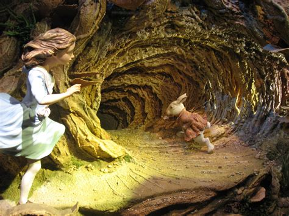

# 2 Rabbits and a fox

## it goes like this

> *Once upon a time* **2 rabbits** live in what is called a __**rabbithole**__..
> They knew a sly fox was roaming about the pastures so they held a meeting to discuss how to best defend their lands and prevent the sly slithering fox from entering their beloved rabbithole :D

> The meeting went on for ever with foxes sneaking up the rabbit hole. 
> Tensions was rising and instead of worrying about the sly foxes creeping in, most of them got furious at each other. 
> The rabbit with the red had threw a carrot at the white-socked rabbit. 

>When the tension notch down, they decided to hire a group of well-trained armadillos to defend their hole.
>The task wouldn't be easy, since armadillos lived far away, in the hot dessert near El Paso.
>But first they had to distract the fox outside the door so one of them could sneak out and look for the help.

That's when Lola Bunny came in to play. Fresh from the Space Jam 2 set she flew in to help her 'Not Warnes Bros Insured" furry friends.
Little did she know that her insurance policies didn't cover distracting foxes outside a door so they can sneak out and look for help.
Actually this misdemeanor means a 3 to 10 year jail sentence. So they had to find another way.
